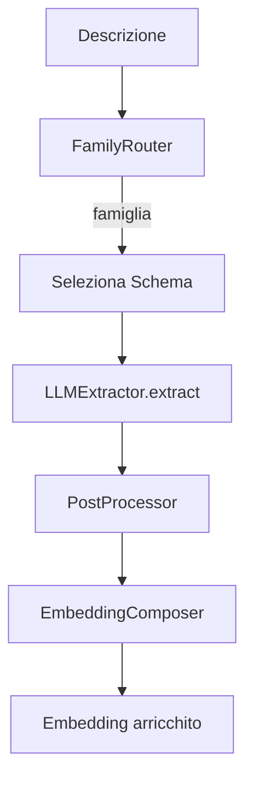

# 22 - Modulo LLM Extraction: architettura, provider, schema, debug

Obiettivo: capire il sistema di estrazione strutturata di proprietà dalle descrizioni usando LLM. Questo modulo trasforma testo libero (es. "Parete in cartongesso Knauf GKB sp. 12,5 mm con lana di roccia 40 mm") in proprietà strutturate con evidenza e confidenza.

Il modulo è pensato per essere:

- **pragmatico**: usa LLM ma con anti-hallucination esplicito
- **estensibile**: nuove famiglie tecniche si aggiungono facilmente
- **robusto**: retry, validazione JSON, normalizzazione output

## 22.1 - Dove sta e com'è organizzato

Cartella: `services/importer/embedding/extraction/`

Struttura:

```
extraction/
├── __init__.py
├── llm_extractor.py      # Client LLM multi-provider
├── router.py             # Router famiglie tecniche
├── embedding_composer.py # Composizione embedding pesato
├── postprocessor.py      # Normalizzazione output
├── families/
│   ├── registry.py       # Keyword signals per famiglia
├── schemas/
│   ├── __init__.py
│   ├── core.py           # Schema base trans-categorico
│   ├── cartongesso.py    # Estensione per cartongesso
│   ├── pavimenti.py      # Estensione per pavimenti
│   └── ...               # Altri schemi specializzati
└── tests/                # Test e benchmark
```

## 22.2 - Concetti chiave

### 22.2.1 - EvidenceSlot: la struttura fondamentale

Ogni proprietà estratta è un "slot" con tre campi:

```python
class EvidenceSlot(BaseModel):
    value: Optional[Union[str, int, float, List[Any]]] = None
    evidence: Optional[Union[str, List[str]]] = None  # substring dal testo
    confidence: float = 0.0  # 0.0-1.0
```

Perché questa struttura:

- `value`: il valore estratto (può essere lista per item multi-layer)
- `evidence`: la **porzione esatta** del testo da cui deriva (anti-hallucination)
- `confidence`: quanto l'LLM è sicuro (1.0 = esplicito, <0.5 = inferito)

### 22.2.2 - Famiglie tecniche

Le lavorazioni edili appartengono a "famiglie" con proprietà specifiche:

| Famiglia | Esempio proprietà specifiche |
|----------|------------------------------|
| `cartongesso` | `board_type`, `frame_spacing_mm`, `insulation_type` |
| `serramenti` | `glass_type`, `frame_material`, `opening_type` |
| `pavimenti` | `tile_size`, `joint_width`, `substrate_type` |
| `controsoffitti` | `suspension_type`, `panel_material` |
| `coibentazione` | `insulation_material`, `lambda_value` |

La famiglia `core` contiene proprietà trans-categoriche che valgono per tutte:

- `material`, `thickness_mm`, `width_cm`, `height_cm`
- `finish`, `fire_class`, `acoustic_class`, `brand`

## 22.3 - FamilyRouter: instradamento debole

File: `services/importer/embedding/extraction/router.py`

Il router classifica una descrizione nelle famiglie candidate **prima** di chiamare l'LLM. Questo permette di:

1. Selezionare lo schema giusto (core vs specializzato)
2. Fornire contesto all'LLM ("Famiglia tecnica: cartongesso")
3. Ridurre hallucination su proprietà non pertinenti

### Come funziona

Il router usa **keyword scoring**:

```python
FAMILY_SIGNALS = {
    "cartongesso": {
        "primary": [r"\bcartongesso\b", r"\bknauf\b", r"\bgyproc\b", ...],  # peso 1.0
        "secondary": [r"\bparete\b", r"\bisolamento\b", ...],                # peso 0.5
        "negative": [r"\bcemento\b", r"\bmuratura\b", ...],                  # peso -0.5
    },
    ...
}
```

Calcolo score:

1. +1.0 per ogni match `primary`
2. +0.5 per ogni match `secondary`
3. -0.5 per ogni match `negative`
4. Normalizza a [0, 1] dividendo per saturazione (default 3.0)

Esempio uso:

```python
router = FamilyRouter()
matches = router.route("Parete in cartongesso Knauf GKB con isolamento", top_k=2)
# matches[0] = FamilyMatch(family_id="cartongesso", score=0.83, matched_keywords=[...])
```

### Metodi principali

| Metodo | Scopo |
|--------|-------|
| `route(text, top_k, min_score)` | Classifica da descrizione |
| `route_wbs6(wbs6_text, ...)` | Classifica da codice WBS6 (più restrittivo) |
| `get_best_family(text, fallback)` | Ritorna la famiglia migliore o fallback |

## 22.4 - LLMExtractor: estrazione strutturata

File: `services/importer/embedding/extraction/llm_extractor.py`

### Provider supportati

| Provider | Modello default | Env var |
|----------|-----------------|---------|
| `openai` | `gpt-4o-mini` | `OPENAI_API_KEY` |
| `anthropic` | `claude-3-haiku` | `ANTHROPIC_API_KEY` |
| `google` | `gemini-1.5-flash` | `GEMINI_API_KEY` |
| `mistral` | `mistral-large-latest` | `MISTRAL_API_KEY` |
| `ollama` | (locale) | `OLLAMA_BASE_URL` |

### Inizializzazione

```python
extractor = LLMExtractor(
    provider="openai",
    model="gpt-4o-mini",
    api_key=None,  # legge da env
    max_retries=2,
)
```

### Metodo `extract()`

```python
result = extractor.extract(
    description="Fornitura e posa parete cartongesso Knauf W111...",
    schema={"material": {"value": None, "evidence": None, "confidence": 0.0}, ...},
    family="cartongesso",
    wbs6="PARETI IN CARTONGESSO",
)
```

Ritorna uno schema compilato con valori, evidenze e confidenze.

### Il prompt anti-hallucination

Il prompt è costruito per minimizzare hallucination:

```text
=== REGOLE TASSATIVE ===
1. Estrai SOLO informazioni ESPLICITAMENTE presenti nel testo
2. Per ogni proprietà devi fornire:
   - value: il valore estratto
   - evidence: la SUBSTRING ESATTA del testo
   - confidence: 0.0-1.0 (1.0 = esplicito, 0.5 = inferito)
3. Se un'informazione NON è presente, usa null per value
4. NON inventare valori
5. L'evidence deve essere una COPIA LETTERALE del testo
```

Questa struttura forza l'LLM a:

- Non inventare ("Se non c'è, metti null")
- Giustificare ("Mostrami da dove l'hai preso")
- Quantificare la certezza ("Quanto sei sicuro?")

### Multi-layer items

Per descrizioni con più strati (es. doppia lastra):

```json
{
  "board_type": {
    "value": ["GKB standard", "Diamant antincendio"],
    "evidence": ["tipo \"Knauf GKB\"", "tipo \"Knauf Diamant\""],
    "confidence": 1.0
  }
}
```

## 22.5 - Schemi: CoreProperties e estensioni

### Schema base (core.py)

```python
class CoreProperties(BaseModel):
    # Materiale base
    material: EvidenceSlot = EvidenceSlot()
    
    # Dimensioni
    thickness_mm: EvidenceSlot = EvidenceSlot()
    width_cm: EvidenceSlot = EvidenceSlot()
    height_cm: EvidenceSlot = EvidenceSlot()
    
    # Finitura
    finish: EvidenceSlot = EvidenceSlot()
    
    # Certificazioni
    fire_class: EvidenceSlot = EvidenceSlot()
    acoustic_class: EvidenceSlot = EvidenceSlot()
    
    # Brand
    brand: EvidenceSlot = EvidenceSlot()
```

### Estensione per cartongesso

```python
class CartongessoProperties(CoreProperties):
    # Orditura
    frame_type: EvidenceSlot = EvidenceSlot()
    frame_spacing_mm: EvidenceSlot = EvidenceSlot()
    frame_material: EvidenceSlot = EvidenceSlot()
    
    # Lastre
    board_type: EvidenceSlot = EvidenceSlot()
    board_layers: EvidenceSlot = EvidenceSlot()
    
    # Isolamento
    insulation_type: EvidenceSlot = EvidenceSlot()
    insulation_thickness_mm: EvidenceSlot = EvidenceSlot()
    
    # Parete
    wall_total_thickness_mm: EvidenceSlot = EvidenceSlot()
```

### Come aggiungere una nuova famiglia

1. Crea `schemas/nuova_famiglia.py` che estende `CoreProperties`
2. Aggiungi keyword signals in `families/registry.py`
3. Nel codice di estrazione, mappa famiglia → schema

## 22.6 - PostProcessor: normalizzazione

File: `services/importer/embedding/extraction/postprocessor.py`

Dopo l'estrazione LLM, i valori vengono normalizzati:

| Campo | Normalizzazione |
|-------|-----------------|
| `thickness_mm`, `*_mm` | Converte da cm se necessario |
| `width_cm`, `height_cm` | Converte da mm se necessario |
| `fire_class` | Normalizza "rei120" → "REI 120" |
| `board_layers` | "doppia lastra" → 2 |

Esempio:

```python
from embedding.extraction.postprocessor import postprocess_properties

raw = {"thickness_mm": {"value": "1.25 cm", "evidence": "sp. 1,25 cm", "confidence": 1.0}}
processed = postprocess_properties(raw)
# processed["thickness_mm"]["value"] = 12.5  (mm)
```

## 22.7 - EmbeddingComposer: embedding arricchito

File: `services/importer/embedding/extraction/embedding_composer.py`

Dopo l'estrazione, si può calcolare un embedding "arricchito" che combina:

- **base_text**: descrizione originale (peso 0.6)
- **detail_text**: proprietà estratte serializzate (peso 0.4)

Questo migliora la ricerca semantica perché:

- La descrizione originale cattura il "cosa"
- Le proprietà estratte catturano il "quanto/come"

```python
composer = EmbeddingComposer(base_weight=0.6, detail_weight=0.4)

base, detail = composer.compose_text(
    description="Parete cartongesso Knauf...",
    extracted_props={"thickness_mm": {"value": 12.5, "confidence": 1.0}, ...},
)

embedding = composer.compute_weighted_embedding(base, detail)
```

## 22.8 - Pipeline completa: descrizione → embedding arricchito

Flusso tipico:



Codice:

```python
# 1. Route
router = FamilyRouter()
family = router.get_best_family(description, fallback="core")

# 2. Select schema
if family == "cartongesso":
    schema = CartongessoProperties()
else:
    schema = CoreProperties()

# 3. Build template
template = {field: {"value": None, "evidence": None, "confidence": 0.0} 
            for field in schema.__fields__}

# 4. Extract
extractor = LLMExtractor(provider="openai", model="gpt-4o-mini")
extracted = extractor.extract(description, template, family)

# 5. Postprocess
from embedding.extraction.postprocessor import postprocess_properties
processed = postprocess_properties(extracted)

# 6. Compute embedding
composer = EmbeddingComposer()
base, detail = composer.compose_text(description, processed)
embedding = composer.compute_weighted_embedding(base, detail)
```

## 22.9 - Benchmark e test

Cartella: `services/importer/embedding/extraction/tests/`

File di test disponibili:

- `test_benchmark.py`: benchmark su goldenset di descrizioni
- `goldenset_candidates.json`: descrizioni reali per test
- `benchmark_results.json`: risultati ultimo benchmark

Eseguire benchmark:

```bash
cd services/importer
python test_benchmark.py
```

Il benchmark produce:

- Statistiche per famiglia (quanti item per famiglia)
- Media confidenza estratta
- Durata media per item
- Conteggio slot validi

## 22.10 - Debug e troubleshooting

### Problema: "No API key found"

Controlla che in `.env` ci sia la chiave corretta:

```env
OPENAI_API_KEY=sk-...
# oppure
GEMINI_API_KEY=...
```

### Problema: JSON parsing fallisce

L'LLM a volte ritorna markdown code blocks. Il parser li rimuove automaticamente, ma se persiste:

1. Abbassa `temperature` (già 0.1 di default)
2. Usa modelli con `response_format: json_object` (OpenAI, Mistral)

### Problema: troppi valori null

Possibili cause:

1. Descrizione troppo vaga → normale, significa che non c'è informazione
2. Schema troppo specifico → usa CoreProperties invece di schema esteso
3. Famiglia sbagliata → controlla output del router

### Problema: confidence sempre bassa

L'LLM è conservativo per design. Confidenza < 0.5 significa che ha *inferito*, non *letto esplicitamente*. Questo è corretto.

## 22.11 - Esercizio: aggiungere famiglia "impianti"

Scenario: vuoi estrarre proprietà da descrizioni di impianti elettrici/idraulici.

Passi:

1. Crea `schemas/impianti.py`:

```python
from .core import CoreProperties, EvidenceSlot

class ImpiantiProperties(CoreProperties):
    system_type: EvidenceSlot = EvidenceSlot()  # "elettrico", "idraulico", "gas"
    pipe_diameter_mm: EvidenceSlot = EvidenceSlot()
    cable_section_mm2: EvidenceSlot = EvidenceSlot()
    protection_class: EvidenceSlot = EvidenceSlot()  # "IP44", "IP65"
```

2. Aggiungi a `families/registry.py`:

```python
FAMILY_SIGNALS["impianti"] = {
    "primary": [r"\bimpiant\w+\b", r"\belettr\w+\b", r"\bidrau\w+\b", r"\btubazion\w+\b"],
    "secondary": [r"\bcav\w+\b", r"\bcondut\w+\b", r"\bquadro\b"],
    "negative": [],
}
```

3. Nel codice di estrazione, aggiungi il mapping.


