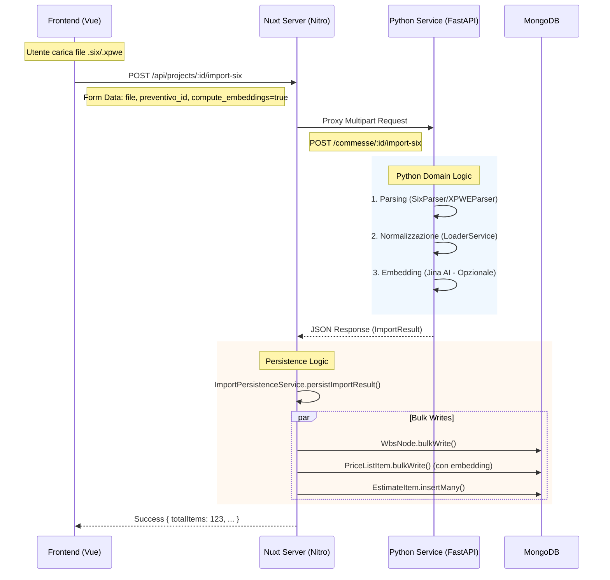

# Taboolo Import Architecture

Questo documento descrive il flusso di importazione dei computi metrici (SIX, XPWE) e il passaggio dei dati tra Frontend, Server Nitro e Servizio Python.

## Standard Import Pipeline (ex "Raw Mode")

La modalità "Standard" (precedentemente nota come "Raw") è il flusso consolidato per l'importazione. Delega interamente il parsing del file al microservizio Python. Invece di una logica "legacy" basata su parser TypeScript parziali, il Python restituisce una rappresentazione completa e denormalizzata del computo, che il server Nuxt si limita a persistere.

> **Nota Bene:** In questa documentazione e nel codice potresti ancora trovare riferimenti a "raw" (es. `import-six/raw`). Questi identificano la pipeline standard corrente.

## Diagramma di Flusso Applicativo



## Schemi Dati

### 1. Python Output (`ImportResult`)

Questo è il JSON che il servizio Python restituisce al Server Nuxt.

```typescript
// Rappresentazione TypeScript del payload JSON
interface PythonImportResult {
    // Info Progetto (opzionale se già esistente)
    project?: { ... };

    // Albero WBS appiattito
    groups: Array<{
        id: string;          // ID temporaneo o originale
        parentId?: string;   // ID del padre
        code: string;        // Codice WBS
        description: string;
        level: number;       // Livello gerarchico (1-7)
    }>;

    // Listino Prezzi associato (FONTE DI VERITA' PER DESCRIZIONI)
    price_list: {
        name: string;
        items: Array<{
            id: string;
            code: string;            // Articolo di elenco
            description: string;     // DESCRIZIONE BREVE
            long_description?: string; // DESCRIZIONE ESTESA
            price: number;
            unit: string;
            wbsIds: string[];        // Collegamento a 'groups'
            embedding?: number[];    // Vettore Jina (Nuovo!)
        }>
    };

    // Computo Metrico
    estimate: {
        name: string;
        is_baseline: boolean;
        items: Array<{
            priceListItemId: string; // Collegamento a 'price_list.items'
            quantity: number;
            measurements: Array<{ ... }>; // Dettagli righi di misurazione
            wbsIds: string[];        // Override WBS riga
            // NB: description/long_description NON sono presenti qui, vengono lette dal listino.
        }>
    };
}
```

### 2. Differenze SIX vs XPWE

Sebbene l'output sia identico (`ImportResult`), il processo interno cambia:

*   **SIX (STR Vision)**:
    *   Struttura gerarchica nativa rigorosa.
    *   Gli ID sono spesso UUID interni del file XML.
    *   I nodi WBS sono ben definiti (Supercategorie, Categorie, ecc.).

*   **XPWE (PriMus)**:
    *   Struttura più "piatta" o basata su codici parlanti.
    *   Necessita di **WBS Mapping** (gestito dal Frontend) per mappare i livelli di PriMus (es. "Categorie", "Lavorazioni") sui livelli standard Taboolo (01-07).
    *   Il backend Python riceve il mapping JSON e normalizza i livelli prima di restituire l'albero `groups`.

## Perché "Raw"?

Il termine "Raw" è storico.
- **Legacy**: Il parser TypeScript estraeva solo alcuni campi per mostrare una tabella semplice.
- **Standard (ex Raw)**: Il parser Python estrae *tutto*, incluse le misurazioni complesse, le formule e la struttura WBS completa, permettendo una ricostruzione fedele del progetto.

Oggi questa è la modalità standard di produzione.
