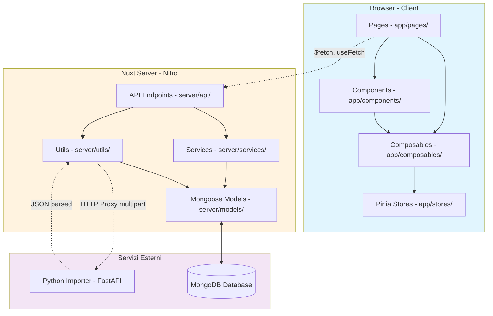
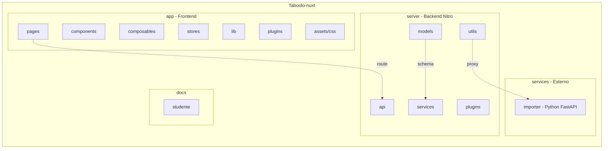
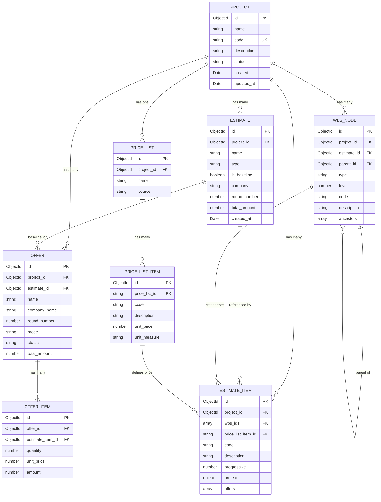
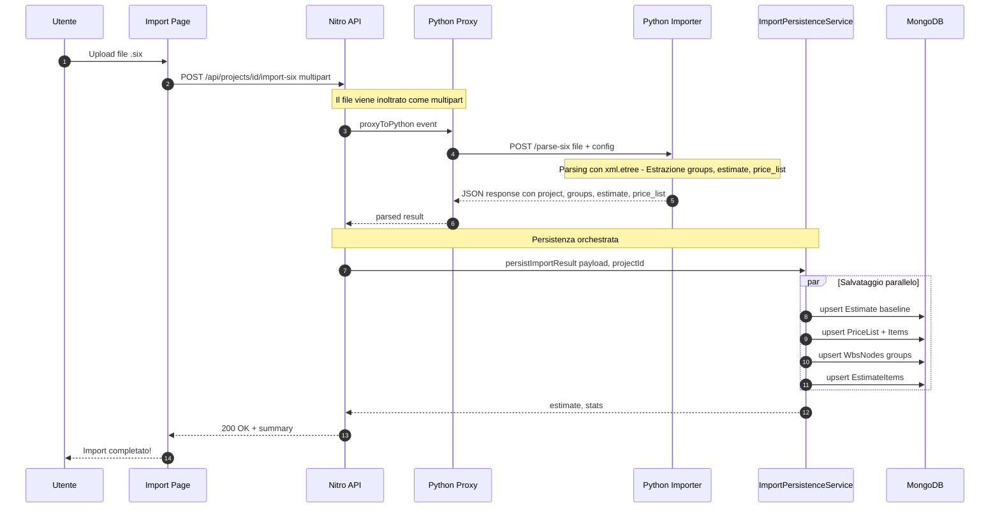
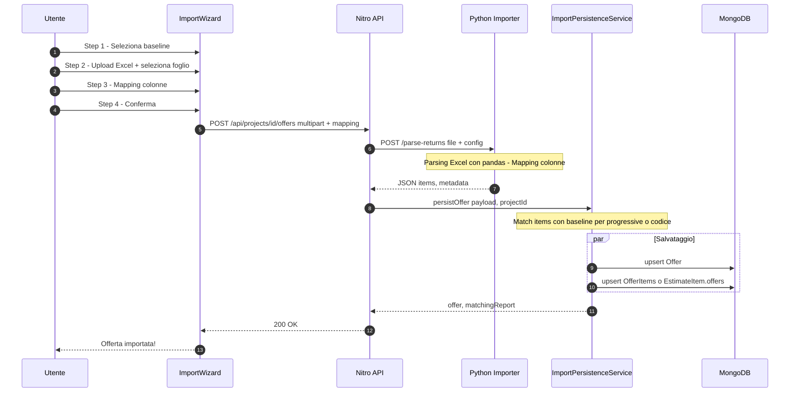
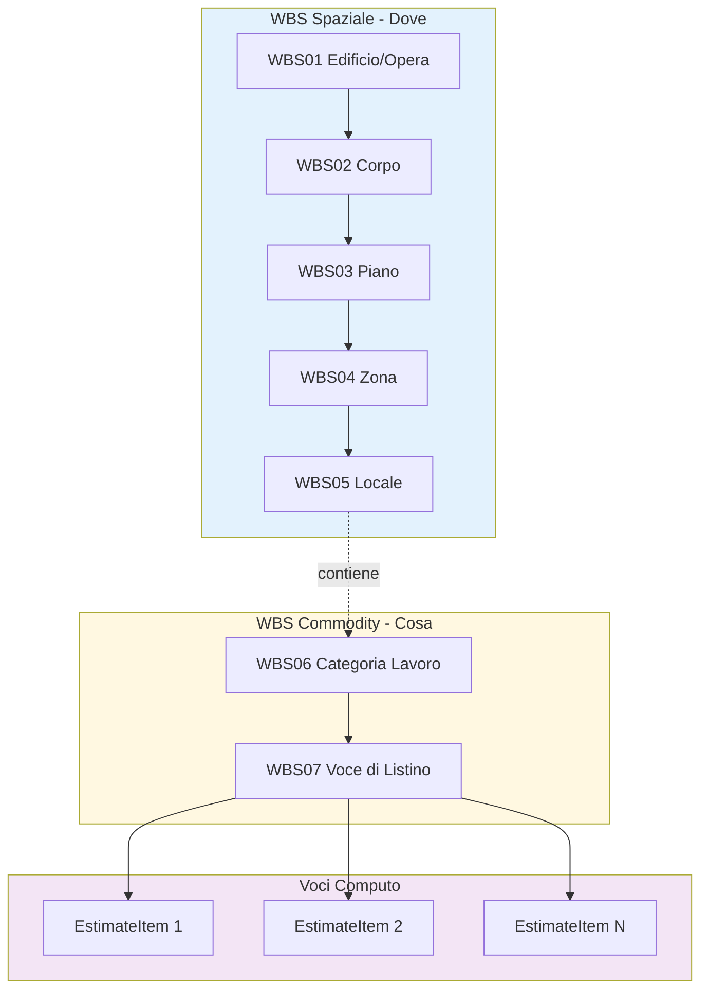
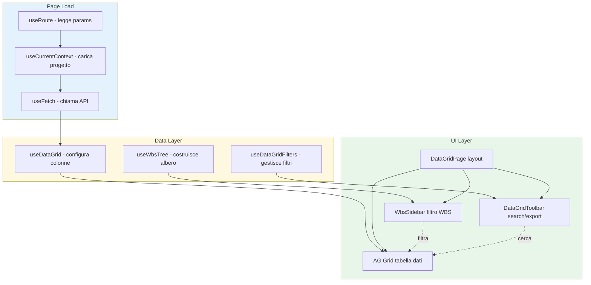
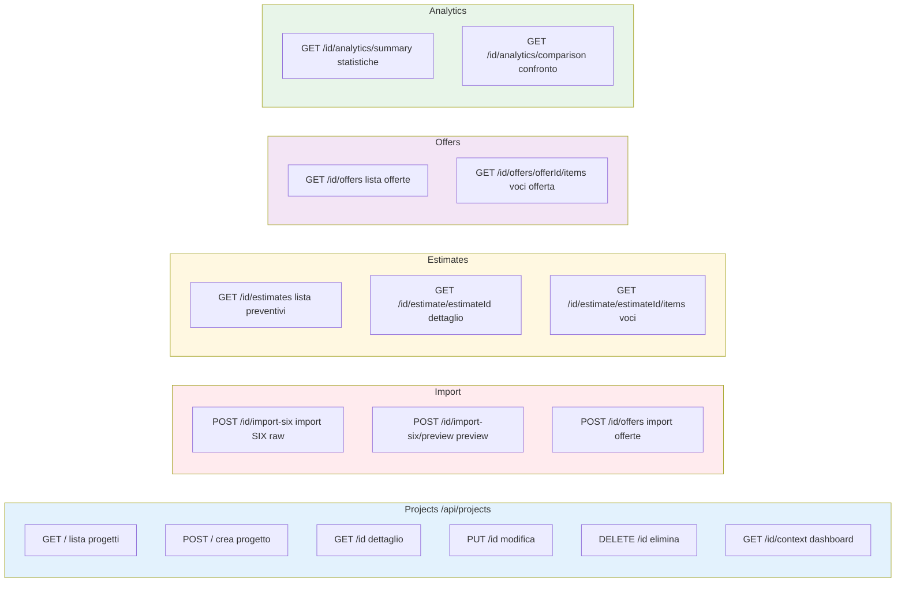
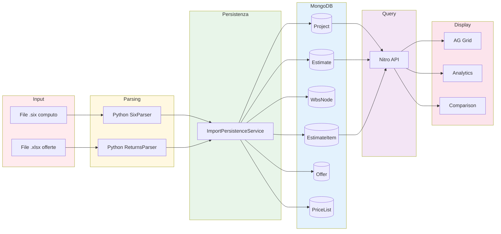
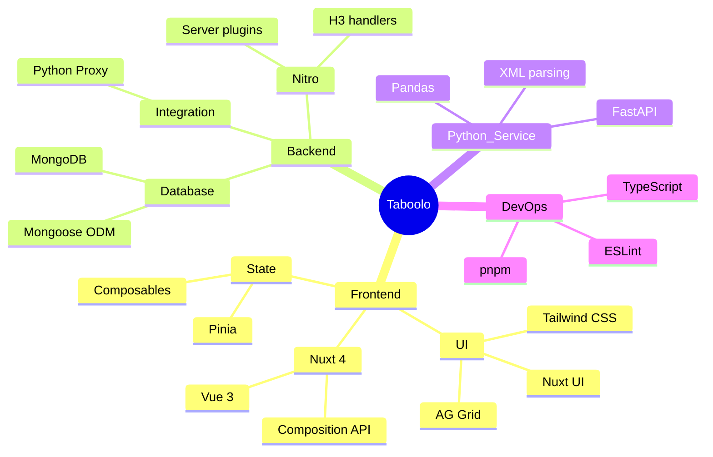

# Diagrammi Architettura - Visione Completa

> Questa pagina contiene i diagrammi fondamentali per capire come è fatto Taboolo.
>
> **Come usarla**: leggi i diagrammi dall'alto verso il basso. Ogni sezione risponde a una domanda specifica sull'architettura.

---

## 1. Architettura Generale (Vista 10.000 piedi)

> [!TIP]
> Questo è il "big picture": mostra come i tre macro-componenti parlano tra loro.



---

## 2. Struttura Cartelle (Dove Sta Cosa)

> [!NOTE]
> Quando devi modificare qualcosa, parti sempre da qui per trovare il file giusto.



---

## 3. Modello Dati (Entity Relationship)

> [!IMPORTANT]
> Questo diagramma mostra **come sono collegate le entità** nel database MongoDB.



---

## 4. Flusso Import SIX (da File a Database)

> [!IMPORTANT]
> Questo è il flusso più complesso: come un file `.six` diventa dati persistiti.



---

## 5. Flusso Import Offerte Excel

> [!NOTE]
> Questo flusso gestisce l'import dei "ritorni" dalle imprese.



---

## 6. Struttura WBS (Work Breakdown Structure)

> [!TIP]
> La WBS è gerarchica: da wbs01 (edificio) fino a wbs07 (voce di listino).



### Esempio Concreto

```
WBS01: Scuola Elementare
├── WBS02: Corpo A
│   ├── WBS03: Piano Terra
│   │   ├── WBS04: Zona Servizi
│   │   │   ├── WBS05: Bagno Maschi
│   │   │   │   ├── WBS06: Impianto Idrico
│   │   │   │   │   ├── WBS07: Tubazioni
│   │   │   │   │   │   └── Item: Tubo rame 22mm (5 ml)
│   │   │   │   │   └── WBS07: Sanitari
│   │   │   │   │       └── Item: Lavabo (2 pz)
```

---

## 7. Flusso Pagina Frontend

> [!NOTE]
> Questo mostra il ciclo di vita tipico di una pagina con griglia.



---

## 8. API Endpoints (Mappa Visuale)



---

## 9. Ciclo di Vita Dati (Da Import a Visualizzazione)



---

## 10. Stack Tecnologico



---

## Prossimi Passi

Ora che hai visto l'architettura:

1. **Approfondisci il modello dati** → `docs/studente/appendici/tecnico/03-modello-dati.md`
2. **Segui un flusso import** → `docs/studente/parte-c-dominio-feature/10-importer-python.md`
3. **Esplora le pagine** → `docs/studente/appendici/tecnico/09-frontend-pagine-componenti.md`

> [!TIP]
> Stampa questa pagina o tienila aperta: ti servirà come riferimento continuo mentre esplori il codice.
