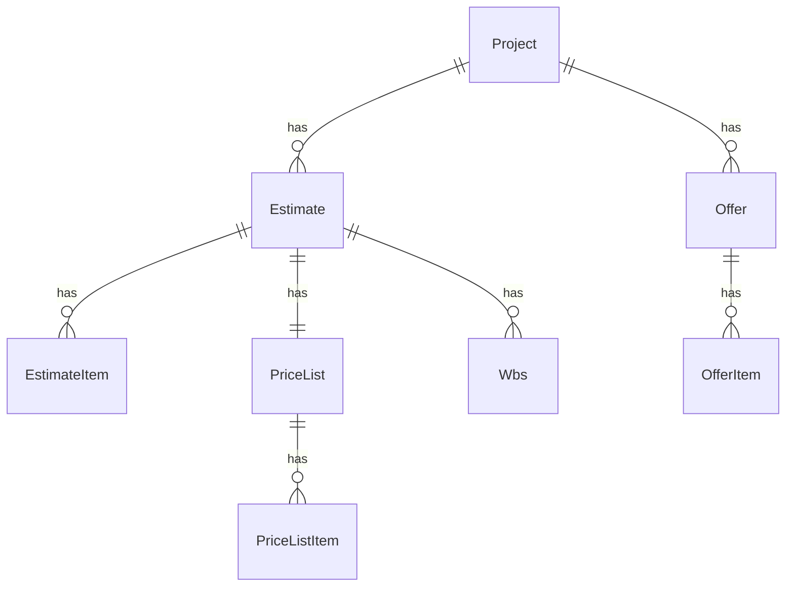

# 09 - Dominio Taboolo: progetti, preventivi, offerte, WBS, listino

Obiettivo: capire il modello mentale dell'app e perché i dati sono organizzati così.

Questo capitolo è importante perché Taboolo è "data-heavy": quasi tutto quello che fai (import, confronto, listino, analytics) dipende da come interpreti il dominio e da quali invarianti mantieni vere.

> Nota: useremo nomi "business" (Progetto/Preventivo/Offerta) e i nomi tecnici (Project/Estimate/Offer) insieme.

## 09.1 - Glossario minimo (prima di tutto)

- Progetto / Commessa: unità di lavoro principale. Nel DB è `Project`.
- Preventivo baseline / Computo di progetto: il "vero" computo di riferimento del progetto. Nel DB è `Estimate` con `type='project'` (e le righe sono `EstimateItem`).
- Offerta / Ritorno: computo inviato da un'impresa, collegato a una baseline. Nel DB è `Offer` (testata) + `OfferItem` (righe).
- Round: numero di tornata (1, 2, 3...) con cui una stessa impresa può inviare più offerte.
- WBS: Work Breakdown Structure. Gerarchia usata per analizzare e filtrare (sidebar, aggregazioni).
- Listino: elenco voci (prodotti/codici) usato per agganciare e confrontare. Nel DB è `PriceList` + `PriceListItem`.
- Pending resolution: stato in cui una riga offerta non ha un match univoco sul listino.

## 09.2 - Il problema che Taboolo risolve

Dato un progetto (commessa) con un computo baseline:

- importiamo un file SIX/XML e otteniamo baseline + WBS + listino + righe

Poi importiamo una o più offerte (ritorni Excel) per:

- impresa
- round

E vogliamo:

- confrontare offerte vs baseline (per riga o per voce di listino)
- analizzare per WBS (macro-categorie e sottocategorie)
- gestire ambiguità quando l'offerta non si aggancia bene (pending)

In breve: Taboolo serve a trasformare "file diversi e imperfetti" in un modello dati confrontabile e navigabile.

## 09.3 - Entità principali (DB) e responsabilità

### Project (progetto/commessa)

È il contenitore principale.

Schema: `server/models/project.schema.ts`

Contiene riferimenti/collegamenti logici a:

- preventivi baseline (`Estimate`)
- offerte (`Offer`)

### Estimate (preventivo)

Nel codice esiste un modello `Estimate` che può rappresentare più tipi, ma la parte "stabile" e centrale è:

- baseline: `Estimate.type = 'project'`

Schema: `server/models/estimate.schema.ts`

### EstimateItem (righe del computo baseline)

Righe del computo di progetto.

Regola mentale:

- `EstimateItem` = "riga del progetto" (quantità, prezzo, importo, WBS, collegamento a listino)

Schema: `server/models/estimate-item.schema.ts`

### Offer (testata offerta)

Rappresenta: "Impresa X, Round Y, collegata alla baseline Z".

Campi tipici:

- `project_id`
- `estimate_id` (baseline)
- `company_name`
- `round_number`
- `mode` (detailed/aggregated)

Schema: `server/models/offer.schema.ts`

### OfferItem (righe offerta)

Righe di un'offerta. Supporta due strategie di collegamento:

- detailed (tipicamente MX): link a una riga baseline (`estimate_item_id`)
- aggregated (tipicamente LX): link a una voce di listino (`price_list_item_id`)

Campi di dominio importanti:

- `origin`:
  - `baseline`: riga riconducibile a baseline/listino
  - `addendum`: riga nuova, non matchata
- `resolution_status`:
  - `resolved`: match univoco
  - `pending`: ambiguità da risolvere
- `candidate_price_list_item_ids`: candidati PLI quando non c'è match univoco (LX)

Schema: `server/models/offer-item.schema.ts`

### Wbs (nodi WBS)

Struttura gerarchica per filtri e analisi.

Caratteristica chiave: WBS è per-estimate (vedi sezione 09.5).

Schema: `server/models/wbs.schema.ts`

### PriceList / PriceListItem (listino per estimate)

Voce di listino = prodotto/codice con prezzo e WBS (spesso WBS6/WBS7).

Regola mentale:

- `PriceListItem` = "voce di listino", non "riga di computo"

Schema:

- `server/models/price-list.schema.ts`
- `server/models/price-list-item.schema.ts`

## 09.4 - Relazioni e chiavi: come si collegano le cose

Il progetto usa un set ridotto di chiavi che si ripetono ovunque:

- `project_id`: contesto principale
- `estimate_id`: baseline (e namespace di listino/WBS)
- `offer_id`: testata offerta

Relazioni chiave:

- Project 1 -> N Estimate (baseline importate o versioni)
- Estimate 1 -> N EstimateItem
- Project 1 -> N Offer
- Offer 1 -> N OfferItem
- (Project, Estimate) 1 -> 1 PriceList
- (Project, Estimate) 1 -> N PriceListItem
- (Project, Estimate) 1 -> N Wbs node

Puoi visualizzarlo così:

## 09.5 - Perché "namespace per estimate" (regola anti-collisione)

Un progetto può contenere:

- più baseline nel tempo (re-import, revisioni)
- più offerte collegate a baseline diverse

Se WBS e listino fossero globali sul progetto, avresti collisioni:

- WBS di una baseline contaminerebbe le altre
- listino di una baseline altererebbe match e confronto di un'altra

Quindi:

- WBS e listino sono filtrati da `estimate_id`
- molte API richiedono `estimate_id` esplicito (o lo derivano dal contesto selezionato)

Questa scelta è una delle parti "blindate" dell'architettura: cambiarla dopo è molto costoso.

## 09.6 - Offerte: detailed vs aggregated (e perché esistono due modalità)

Taboolo gestisce offerte provenienti da formati diversi e con granularità diversa.

- Detailed (MX):
  - l'offerta mantiene un progressivo o un riferimento che permette di agganciare direttamente una riga baseline
  - lato DB: `OfferItem.estimate_item_id` diventa il link principale
- Aggregated (LX):
  - l'offerta non ha un aggancio 1:1 alla riga baseline
  - si lavora per voce di listino (codice/prodotto)
  - lato DB: `OfferItem.price_list_item_id` (oppure pending se ambiguo)

Conseguenza: confronto e analytics devono saper leggere entrambi.

## 09.7 - Pending resolution: quando i dati sono ambigui

Scenario tipico (aggregated/LX):

- una riga offerta ha una descrizione troppo generica
- oppure il codice non è univoco
- oppure ci sono più `PriceListItem` plausibili

Allora:

1) l'import salva `candidate_price_list_item_ids`
2) la riga resta `resolution_status = pending`
3) la UI chiede all'utente di scegliere il match corretto
4) una PATCH aggiorna `price_list_item_id` e rende la riga `resolved`

Endpoint utili:

- pending list: `GET /api/projects/:id/offers/pending`
- resolve item: `PATCH /api/projects/:id/offers/items/:itemId`

## 09.8 - UX map: schermate principali -> dati -> endpoint

| Schermata | Dati principali | Endpoint |
|---|---|---|
| Lista progetti | Project | `GET /api/projects` |
| Dashboard progetto | Project + Estimates + Offers (metadata) | `GET /api/projects/:id/context` |
| Shell preventivo | contesto estimate + offers per round/company | `GET /api/projects/:id/offers?estimate_id=...` |
| Dettaglio baseline | EstimateItem (+ join PLI/WBS) | `GET /api/projects/:id/estimate/:estimateId/items` |
| Dettaglio offerta | OfferItem (+ join baseline/PLI/WBS) | `GET /api/projects/:id/estimate/:estimateId/items?round&company` |
| Listino | PriceListItem (+ totali) | `GET /api/projects/:id/estimates/:estimateId/price-list` |
| Confronto | aggregazione per PLI con colonne imprese | `GET /api/projects/:id/estimate/:estimateId/comparison` |

Riferimento pagine: `docs/studente/appendici/riferimento/pagine-routes.md`.

## 09.9 - Invarianti (regole da mantenere vere)

Quando evolvi il progetto, tieni vere queste invarianti:

1) Un `Offer` deve sempre puntare a una baseline (`Offer.estimate_id`).
2) Una riga offerta detailed deve avere `estimate_item_id`.
3) Una riga offerta aggregated deve avere `price_list_item_id` oppure essere `pending`.
4) WBS e listino devono essere sempre per-estimate (niente cross-contamination).

Se rompi una di queste, listino e confronto diventano incoerenti.

## 09.10 - Esercizi (per capire davvero)

### Esercizio 1: traccia un flusso completo (offerta)

Scenario:

"Voglio vedere le voci dell'offerta di Impresa Rossi, Round 2".

Traccia:

1) pagina UI che apro
2) query string (`round`, `company`)
3) endpoint chiamato
4) collezioni coinvolte (Offer, OfferItem, EstimateItem, PriceListItem, Wbs)

Suggerimento: leggi `server/api/projects/[id]/estimate/[estimateId]/items.get.ts`.

### Esercizio 2: inventa una feature e mappa l'impatto

Feature proposta:

"Aggiungere un campo `revisione_offerta` (string) e mostrarlo in dashboard preventivo."

Mappa cosa devi cambiare:

1) schema `Offer` (DB)
2) import pipeline (`persistOffer`)
3) API `GET /offers` (select fields)
4) UI shell preventivo (colonna o badge)
5) edit modal (PATCH `/offers/:offerId`)

Se sai fare questa mappa, sai lavorare sul dominio Taboolo.
