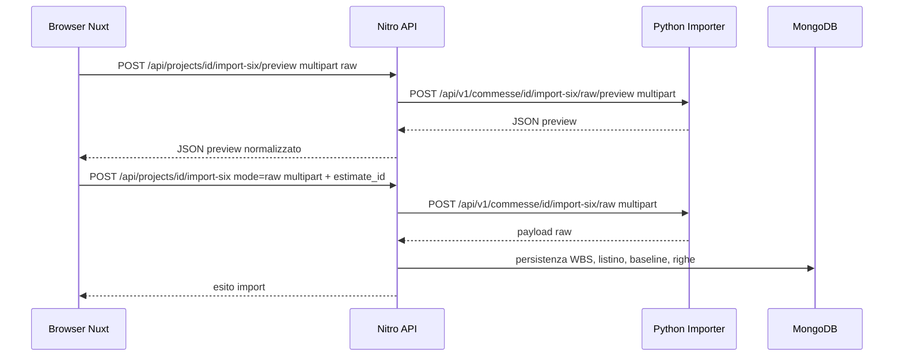

# 10 - Import e persistenza: dal file al DB (SIX + Excel)

Obiettivo: capire come arriviamo da file `.six/.xml` e `.xlsx` ai documenti Mongo, passando da:

- frontend (upload + wizard)
- backend Nitro (proxy + orchestrazione)
- servizio Python (parsing)
- persistenza Mongo (service layer)

Questa è una delle parti più importanti del progetto, perché:

- è dove entrano i dati (spesso sporchi o ambigui);
- è dove si decide la "verità" del dominio (baseline, listino, WBS, offerte);
- è dove un bug piccolo crea conseguenze grandi su listino/confronto/analytics.

Collegamenti:

- panoramica frontend upload: `docs/studente/parte-d-approfondimenti/20-upload-file-excel-e-wizard.md`
- servizio Python: `docs/studente/parte-d-approfondimenti/21-python-importer-servizio.md`

## 10.1 - Perché esiste un importer esterno (Python)

Parsing di formati come SIX/XML e ritorni Excel:

- è più comodo in Python (librerie, velocità di prototipazione, know-how esistente)
- può essere pesante e non vogliamo appesantire Nitro con parsing complesso
- evolve: è un componente con responsabilità propria

Nuxt/Nitro fa da orchestratore:

1) riceve file dal browser (multipart)
2) inoltra a Python (proxy multipart)
3) normalizza/mappa il payload
4) persiste su Mongo con regole di dominio

## 10.2 - Il proxy multipart (Nitro -> Python)

File: `server/utils/python-proxy.ts`

Responsabilità:

1) leggere multipart dal client (`readMultipartFormData`)
2) ricostruire un `FormData` (usando `Blob` per i file)
3) inoltrare a `pythonApiBaseUrl` (runtimeConfig, vedi capitolo 06)
4) propagare status code e payload (anche errori)

Dettagli importanti:

- copia l'header `authorization` se presente
- prova a parse-are JSON in risposta, ma gestisce anche testo
- se Python risponde errore, lancia `createError` includendo `data` con payload

Questo file è il "ponte" che collega due runtime diversi.

## 10.3 - Import baseline SIX/XML (raw)

### 10.3.1 - Endpoint coinvolti (lato Nitro)

Preview:

- `POST /api/projects/:id/import-six/preview?mode=raw`
- file: `server/api/projects/[id]/import-six/preview.post.ts`
- chiama: `previewSixImportRaw` in `server/importers/python-six/client.ts`

Import:

- `POST /api/projects/:id/import-six?mode=raw`
- file: `server/api/projects/[id]/import-six.post.ts`
- chiama: `runSixImportRaw` in `server/importers/python-six/client.ts`
- persiste: `server/services/ImportPersistenceService.ts`

Nota: nel codice esistono anche funzioni "non raw" (`previewSixImport`, `runSixImport`) ma sono legacy/compatibilità. Il flusso attivo per SIX in questa repo è raw.

### 10.3.2 - Endpoint coinvolti (lato Python)

Servizio: `services/importer/`

Endpoint:

- `POST /api/v1/commesse/{commessa_id}/import-six/raw/preview`
- `POST /api/v1/commesse/{commessa_id}/import-six/raw`

Vedi: `services/importer/api/endpoints/raw.py`.

### 10.3.3 - Sequenza (alto livello)



### 10.3.4 - Forma del payload raw (concettuale)

La pipeline moderna ruota attorno a uno shape simile a:

```ts
{
  project: unknown,
  groups: unknown[],      // nodi WBS
  price_list: unknown,    // listino + items
  estimate: {
    type: 'project',
    name: string,
    items: unknown[],
  }
}
```

Nitro mappa/normalizza con:

- `server/utils/python-mappers.ts`

E poi persiste con:

- `server/services/ImportPersistenceService.ts`

### 10.3.5 - Persistenza baseline: `persistProjectEstimate`

File: `server/services/ImportPersistenceService.ts` (funzione interna `persistProjectEstimate`)

Punti chiave (semplificati):

1) risolve `projectObjectId`
2) determina `estimateId` in modo deterministico (namespace per estimate)
3) WBS:
   - crea una mappa sourceId -> new ObjectId
   - `bulkWrite` upsert su `WbsNode` con `project_id + estimate_id`
4) PriceList:
   - upsert `PriceList` con `project_id + estimate_id`
5) PriceListItem:
   - filtra le voci realmente usate dal computo (evita di gonfiare DB)
   - delete+insert per avere un set pulito
6) Estimate (testata baseline):
   - crea/aggiorna `Estimate` (type project)
7) EstimateItem (righe baseline):
   - cancella vecchie righe baseline
   - inserisce nuove righe con WBS + link a listino + importi

Nota: distinte base e listini vengono normalizzati (spazi, newline, caratteri strani) per rendere match e confronto più stabili.

### 10.3.6 - Ottimizzazione: Filtro WBS (Python)

Una particolarità importante del `SixParser` è che **filtra attivamente** i nodi WBS prima di restituire il risultato.

Logica (in `services/importer/parsers/six/parser.py`):

1.  Raccoglie tutti gli ID WBS citati nelle **misurazioni** (righe di computo).
2.  Raccoglie tutti gli ID WBS citati nei **prodotti** (voci di listino).
3.  Costruisce un set di `used_wbs_ids`.
4.  Restituisce nel payload `groups` **solo** i nodi presenti in quel set.

**Perché?** I file SIX esportati spesso contengono l'intera struttura WBS aziendale (migliaia di nodi), anche se il progetto ne usa solo 20. Questo filtro riduce drasticamente:
- la dimensione del JSON scambiato tra Python e Nitro;
- il tempo di scrittura su Mongo (meno documenti `WbsNode` inutili).

## 10.4 - Import offerte (ritorni Excel)

### 10.4.1 - Endpoint coinvolti (lato Nitro)

- `POST /api/projects/:id/offers`
- file: `server/api/projects/[id]/offers.post.ts`

Questo endpoint:

1) inoltra il file a Python (ritorni)
2) mappa il risultato in uno shape "estimate-like" (compatibilità)
3) costruisce un payload e chiama `persistOffer`

### 10.4.2 - Endpoint coinvolti (lato Python)

File: `services/importer/api/endpoints/returns.py`

Endpoint principale usato dal backend:

- `POST /api/v1/commesse/{commessa_id}/ritorni`

Parametri tipici (via multipart form fields):

- `mode`: `lx` | `mx` | `excel`
- `sheet_name`
- `code_columns`, `description_columns`
- `price_column`, `quantity_column`, `progressive_column`
- configurazioni batch/multi-company (se usate)

### 10.4.3 - Un dettaglio importante: perché alcuni dati finiscono in query string

Problema tecnico:

- una request multipart è uno stream
- se la consumi per fare proxy, leggerla due volte è difficile

Soluzione pratica:

- il client invia anche alcune info in query string (es. `estimate_id`, `mode`, `company`, `round_number`)
- Nitro legge quei parametri senza consumare il body

Questo pattern evita bug "mancano campi" dopo il proxy.

## 10.5 - Persistenza offerta: `persistOffer`

File: `server/services/ImportPersistenceService.ts` (export `persistOffer`)

Passi chiave:

1) risolve baseline (`baselineEstId`)
   - se fornita esplicitamente: `payload.estimate.estimate_id`
   - altrimenti: fallback sull'ultima baseline disponibile (loggando la scelta)
2) upsert `Offer` (testata) usando chiave logica:
   - `project_id + company_name + round_number`
3) delete `OfferItem` per quella offerta (evita duplicati su re-import)
4) mapping righe:
   - modalità detailed: match su progressivo verso `EstimateItem._id`
   - modalità aggregated: match su codice/descrizione normalizzata verso `PriceListItem._id`
5) pending:
   - se match non univoco: salva candidati e marca `pending`

Nota: nel service esiste una funzione di normalizzazione testuale che:

- rimuove newline, spazi multipli, sequenze Excel tipo `_x000D_`
- porta a lowercase
- rimuove accenti (per match più robusti)

Questo ti dice una cosa: i dati reali arrivano sporchi, quindi l'import deve essere difensivo.

## 10.6 - Pending resolution (ambiguità)

Quando non esiste un match univoco in aggregated (LX):

- la riga offerta resta `pending`
- la UI deve far scegliere il codice corretto

API:

- `GET /api/projects/:id/offers/pending`
- `PATCH /api/projects/:id/offers/items/:itemId` con `{ price_list_item_id }`

UI:

- listino: `app/pages/projects/[id]/pricelist/index.vue`

## 10.7 - Debug dell'import (checklist)

Quando un import "non torna", non indovinare: segui una checklist.

1) UI:
   - Network tab: endpoint, query string, status code
   - file corretto? sheet corretto? mapping colonne corretto?
2) Nitro:
   - log dell'endpoint (`server/api/...`)
   - log di persistenza (`ImportPersistenceService.ts`)
3) Python:
   - servizio su? `/docs` disponibile (in debug)?
   - errori di parsing? limiti file? rate limit?
4) DB:
   - i documenti sono stati creati?
   - conteggi plausibili: `EstimateItem`, `OfferItem`, `PriceListItem`, `Wbs`

Appendice query: `docs/studente/appendici/tecnico/13-mongo-query.md`.

## 10.8 - Esercizi (consigliati)

1) Prendi un file SIX piccolo e traccia:
   - preview -> import -> DB (quali collezioni cambiano?)
2) Prendi un Excel e forza una ambiguità (descrizione generica):
   - verifica che compaia una pending
   - risolvila e verifica che scompaia
3) Re-import:
   - importa due volte lo stesso file offerte e verifica che non duplichi le righe (grazie a delete+insert)

## 10.9 - Letture reference

- pipeline tecnica: `docs/studente/appendici/tecnico/04-import-pipeline.md`
- route API: `docs/studente/appendici/riferimento/api-routes.md`
