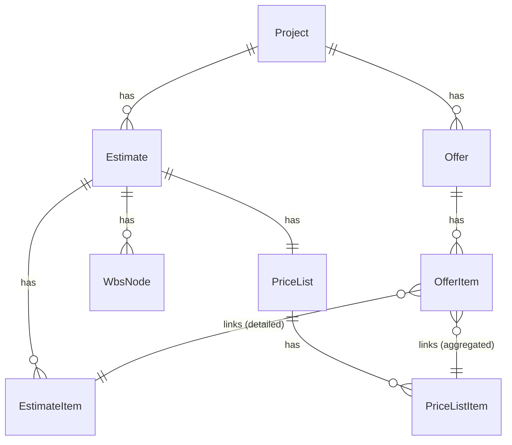

# 04 — Architettura Taboolo: modello dati, cartelle, e dove mettere le mani

Benvenuto al quarto capitolo! Ora che conosci JavaScript/TypeScript e Vue/Nuxt, è il momento di capire come è organizzato specificamente **Taboolo**: il suo modello di dominio, la struttura delle cartelle, e dove intervenire per modificare le cose.

Questo capitolo è una **mappa mentale**. Non leggerlo come narrativa: usalo come riferimento mentre navighi il codice.

**Tempo stimato:** 1 ora (lettura) + tempo variabile (esplorazione codice)

---

## Il problema che Taboolo risolve

Prima di entrare nella tecnica, capiamo il **problema di business**.

### Lo scenario tipico

Un'impresa edile partecipa a una gara d'appalto:

1. Riceve un **computo metrico** (lista di lavorazioni con quantità) dal committente
2. Elabora un **preventivo** con i propri prezzi
3. Invia l'**offerta** alla gara

Il committente riceve offerte da **molte imprese**, su **più round** di gara. Deve confrontarle, capire chi offre il miglior prezzo per ogni lavorazione, identificare anomalie.

### Cosa fa Taboolo

1. **Importa il computo di progetto** (baseline) da file **SIX/XML** — il formato standard usato in edilizia
2. **Importa le offerte** delle imprese da file **Excel**
3. **Confronta** tutto: delta prezzi, migliori offerte per categoria, analisi WBS
4. **Identifica anomalie** con algoritmi di analisi prezzi

In breve: trasforma "file diversi e imperfetti" in un modello dati **confrontabile e navigabile**.

---

## Glossario di dominio (impara questi termini)

| Termine business | Termine tecnico | Significato |
|------------------|-----------------|-------------|
| **Progetto/Commessa** | `Project` | Contenitore principale (es. "Ristrutturazione Scuola X") |
| **Preventivo baseline** | `Estimate` (type='project') | Il computo di riferimento del progetto |
| **Riga computo** | `EstimateItem` | Una lavorazione del computo (quantità, prezzo, importo) |
| **Offerta/Ritorno** | `Offer` | Proposta di un'impresa per un round di gara |
| **Riga offerta** | `OfferItem` | Una riga dell'offerta (prezzo proposto dall'impresa) |
| **Round** | `round_number` | Tornata di gara (1, 2, 3...) |
| **WBS** | `WbsNode` | Gerarchia per categorizzare le lavorazioni |
| **Listino** | `PriceListItem` | Voce di catalogo (codice + descrizione + prezzo + WBS) |
| **Pending resolution** | `resolution_status='pending'` | Riga offerta che non si aggancia univocamente |

---

## Struttura delle cartelle (visione d'insieme)

```
Taboolo-nuxt/
│
├── app/                    # 🎨 FRONTEND (Nuxt/Vue)
│   ├── pages/              # Route = file (routing automatico)
│   ├── components/         # Componenti UI riutilizzabili
│   ├── composables/        # Logica condivisa (hooks)
│   ├── stores/             # Pinia stores (stato globale)
│   ├── lib/                # Utility e API client
│   ├── layouts/            # Layout pagine
│   ├── plugins/            # Plugin Nuxt (AG Grid, Sonner...)
│   └── assets/             # CSS, immagini
│
├── server/                 # 🖥️ BACKEND (Nitro)
│   ├── api/                # REST endpoints
│   ├── models/             # Schemi Mongoose
│   ├── services/           # Logica applicativa
│   ├── utils/              # Utility (proxy, mapper, normalize)
│   └── plugins/            # Plugin Nitro (connessione Mongo)
│
├── services/               # 🐍 SERVIZI ESTERNI
│   └── importer/           # Servizio Python (FastAPI)
│       ├── api/            # Endpoint Python
│       ├── parsers/        # Parser SIX/Excel
│       └── ingestion/        # Pipeline import
│       └── embedding/        # Embedding + LLM extraction
│       └── analytics/        # Analisi prezzi e clustering
│
├── docs/                   # 📚 Documentazione (sei qui!)
├── old/                    # 🗄️ Codice legacy (React) per riferimento
├── types/                  # Tipi TypeScript d'appoggio
└── locales/                # File i18n
```

### Regola pratica: "dove metto le mani?"

| Se devo cambiare... | Guardo in... |
|---------------------|--------------|
| Cosa appare a schermo | `app/pages/` (route) o `app/components/` |
| Logica UI condivisa | `app/composables/` |
| Chiamata HTTP dal frontend | `app/lib/api-client.ts` |
| Endpoint REST | `server/api/` |
| Logica backend | `server/services/` |
| Schema database | `server/models/` |
| Parsing file SIX/Excel | `services/importer/parsers/` |

---

## Modello dati: le entità principali



### Project (Progetto)

Il contenitore principale. Tutto parte da qui.

**Schema**: `server/models/project.schema.ts`

```typescript
interface Project {
    _id: ObjectId
    name: string
    code: string           // es. "SCUOLA-X-2025"
    business_unit?: string
    status: 'setup' | 'in_progress' | 'closed'
    created_at: Date
}
```

### Estimate (Preventivo)

Rappresenta un preventivo. Il più importante è la **baseline** (tipo `project`).

**Schema**: `server/models/estimate.schema.ts`

```typescript
interface Estimate {
    _id: ObjectId
    project_id: ObjectId
    type: 'project' | 'offer'  // 'project' = baseline
    name: string
    created_at: Date
}
```

### EstimateItem (Riga computo)

Una lavorazione del computo baseline.

**Schema**: `server/models/estimate-item.schema.ts`

```typescript
interface EstimateItem {
    _id: ObjectId
    project_id: ObjectId
    estimate_id: ObjectId       // la baseline
    price_list_item_id?: ObjectId
    wbs_ids: ObjectId[]         // gerarchia WBS
    description: string
    unit: string               // es. "mq", "ml", "cad"
    quantity: number
    unit_price: number
    amount: number             // quantity * unit_price
    progressive_number?: number
}
```

### Offer (Offerta)

Testata di un'offerta: impresa + round + baseline di riferimento.

**Schema**: `server/models/offer.schema.ts`

```typescript
interface Offer {
    _id: ObjectId
    project_id: ObjectId
    estimate_id: ObjectId       // la baseline a cui si riferisce
    company_name: string        // es. "Impresa Rossi"
    round_number: number        // 1, 2, 3...
    mode: 'detailed' | 'aggregated'  // MX o LX
    created_at: Date
}
```

### OfferItem (Riga offerta)

Una riga dell'offerta con il prezzo proposto dall'impresa.

**Schema**: `server/models/offer-item.schema.ts`

```typescript
interface OfferItem {
    _id: ObjectId
    offer_id: ObjectId
    project_id: ObjectId
    
    // Link (dipende dalla modalità)
    estimate_item_id?: ObjectId      // modalità detailed/MX
    price_list_item_id?: ObjectId    // modalità aggregated/LX
    
    // Dati
    description: string
    unit: string
    quantity: number
    unit_price: number
    amount: number
    
    // Stato
    origin: 'baseline' | 'addendum'
    resolution_status: 'resolved' | 'pending'
    candidate_price_list_item_ids?: ObjectId[]  // se pending
}
```

### WbsNode (Nodo WBS)

Un nodo della gerarchia WBS (Work Breakdown Structure).

**Schema**: `server/models/wbs.schema.ts`

```typescript
interface WbsNode {
    _id: ObjectId
    project_id: ObjectId
    estimate_id: ObjectId    // IMPORTANTE: WBS è per-estimate!
    code: string             // es. "01.02.03"
    description: string
    level: number            // 1-7
    parent_id?: ObjectId
}
```

### PriceListItem (Voce listino)

Una voce del listino (catalogo prezzi).

**Schema**: `server/models/price-list-item.schema.ts`

```typescript
interface PriceListItem {
    _id: ObjectId
    project_id: ObjectId
    estimate_id: ObjectId    // IMPORTANTE: listino è per-estimate!
    code: string
    description: string
    long_description?: string
    unit: string
    price: number
    wbs_ids: ObjectId[]
    embedding?: number[]     // per ricerca semantica
}
```

---

## Il concetto di "namespace per estimate"

Questa è una **regola architetturale fondamentale** che devi capire:

> **WBS e Listino sono filtrati per `estimate_id`, non solo per `project_id`.**

### Perché?

Un progetto può avere:
- Più baseline nel tempo (re-import, revisioni)
- Offerte collegate a baseline diverse

Se WBS e listino fossero globali sul progetto, ci sarebbero **collisioni**:
- La WBS di una baseline contaminerebbe le altre
- Il listino di una baseline altererebbe i match di un'altra

### Conseguenza pratica

Quando query WBS o listino, **devi sempre specificare `estimate_id`**:

```typescript
// ✅ Corretto
const wbsNodes = await WbsNode.find({ 
    project_id, 
    estimate_id  // <-- obbligatorio!
})

// ❌ Incompleto (potrebbe restituire dati di altri preventivi)
const wbsNodes = await WbsNode.find({ project_id })
```

---

## Modalità offerta: Detailed vs Aggregated

Le offerte arrivano in formati diversi. Taboolo gestisce due modalità:

### Detailed (MX)

L'offerta ha un **progressivo** che aggancia direttamente una riga baseline.

```
Offerta riga 15 → EstimateItem con progressive_number=15
```

**Link principale**: `OfferItem.estimate_item_id`

### Aggregated (LX)

L'offerta è per **voce di listino** (codice/prodotto), non per riga.

```
Offerta codice "VP.01.002" → PriceListItem con code="VP.01.002"
```

**Link principale**: `OfferItem.price_list_item_id`

### Pending Resolution

Quando in modalità LX il match non è univoco:

1. L'import salva i candidati in `candidate_price_list_item_ids`
2. La riga resta `resolution_status = 'pending'`
3. L'utente sceglie manualmente il match corretto
4. Una PATCH aggiorna e rende la riga `resolved`

---

## Frontend: mappa delle pagine

### Flusso utente tipico

```
/projects                          Lista progetti
    ↓
/projects/[id]                     Dashboard progetto
    ↓
/projects/[id]/import              Import (SIX + Excel)
    ↓
/projects/[id]/estimate/[eid]      Shell preventivo
    ↓
/projects/[id]/estimate/[eid]/detail     Dettaglio voci baseline
/projects/[id]/estimate/[eid]/offer      Dettaglio voci offerta
/projects/[id]/estimate/[eid]/comparison Confronto offerte
/projects/[id]/estimate/[eid]/price-list Listino
```

### File corrispondenti

| Route | File |
|-------|------|
| `/projects` | `app/pages/projects/index.vue` |
| `/projects/[id]` | `app/pages/projects/[id]/index.vue` |
| `/projects/[id]/import` | `app/pages/projects/[id]/import/index.vue` |
| `/projects/[id]/estimate/[estimateId]` | `app/pages/projects/[id]/estimate/[estimateId]/index.vue` |
| `/projects/[id]/estimate/[estimateId]/detail` | `app/pages/projects/[id]/estimate/[estimateId]/detail.vue` |

### Componenti chiave

| Componente | Ruolo |
|------------|-------|
| `DataGridPage.vue` | Layout con griglia + header + sidebar |
| `WbsSidebar.vue` | Filtro WBS (albero laterale) |
| `EstimateItemsPage.vue` | Pagina voci (baseline o offerta) |

### Composables chiave

| Composable | Ruolo |
|------------|-------|
| `useCurrentContext` | Contesto progetto/preventivo corrente |
| `useWbsTree` | Costruzione e filtro albero WBS |
| `useDataGrid*` | Configurazione colonne AG Grid |

---

## Backend: mappa degli endpoint

### Struttura `server/api/`

```
server/api/
├── projects/
│   ├── index.get.ts              # GET /api/projects
│   ├── index.post.ts             # POST /api/projects
│   ├── [id]/
│   │   ├── index.get.ts          # GET /api/projects/:id
│   │   ├── context.get.ts        # GET /api/projects/:id/context
│   │   ├── import-six.post.ts    # POST /api/projects/:id/import-six
│   │   ├── offers.post.ts        # POST /api/projects/:id/offers
│   │   └── estimate/
│   │       └── [estimateId]/
│   │           ├── items.get.ts  # GET /api/projects/:id/estimate/:eid/items
│   │           └── ...
└── analytics/
    ├── global-map.post.ts
    └── ...
```

### Endpoint → Dati

| Endpoint | Dati ritornati |
|----------|----------------|
| `GET /api/projects` | Lista Project |
| `GET /api/projects/:id/context` | Project + Estimates + Offers (metadata) |
| `GET /api/projects/:id/estimate/:eid/items` | EstimateItem o OfferItem (con join) |
| `GET /api/projects/:id/estimates/:eid/price-list` | PriceListItem |
| `GET /api/projects/:id/estimate/:eid/comparison` | Aggregazione per confronto |

---

## Servizio Python: `services/importer/`

Il parsing dei file SIX/XML e Excel avviene in **Python**, non in Node.

### Perché Python?

- Librerie mature per parsing XML (`lxml`)
- Librerie per Excel (`openpyxl`, `pandas`)
- Elaborazione numerica (`numpy`, `scikit-learn`)
- Generazione embedding per ricerca semantica

### Flusso

```
Frontend                  Nitro                    Python
   │                        │                        │
   │─── upload file ───────>│                        │
   │                        │─── proxy multipart ───>│
   │                        │                        │─── parse ───>
   │                        │                        │<── result ────
   │                        │<── JSON payload ───────│
   │                        │                        │
   │                        │─── persist to Mongo ──>│
   │<── success response ───│                        │
```

### File chiave

```
services/importer/
├── main.py                    # Entry point FastAPI
├── api/
│   └── endpoints/
│       ├── raw.py             # Import SIX (raw mode)
│       ├── returns.py         # Import offerte Excel
│       └── analytics.py       # UMAP, clustering
├── parsers/
│   ├── six_parser.py          # Parser SIX/XML
│   └── excel_parser.py        # Parser Excel offerte
└── ingestion/
    ├── preview.py               # Preview import
    ├── raw_import_service.py    # Raw import service
└── embedding/
    ├── extraction/              # LLM extraction
└── analytics/
    ├── gravitational_clustering.py
    ├── price_analysis.py
```

---

## Come cercare nel codice

Il superpotere più importante è saper cercare. Usa `ripgrep` (`rg`):

```bash
# Trova dove si chiama un endpoint
rg "/api/projects" app/

# Trova dove si usa un campo
rg "unit_price" server/

# Trova una funzione Backend
rg "persistImportResult" server/

# Trova tutti i composables
rg "^export function use" app/composables/
```

---

## Esercizi pratici

### Esercizio 1: Traccia un flusso

Scenario: "Voglio vedere le voci dell'offerta di Impresa Rossi, Round 2"

Traccia:
1. Quale pagina apro?
2. Quali query params passo?
3. Quale endpoint viene chiamato?
4. Quali collezioni DB sono coinvolte?

**Suggerimento**: leggi `server/api/projects/[id]/estimate/[estimateId]/items.get.ts`

### Esercizio 2: Cambia una colonna

Voglio aggiungere una colonna "Note" alla griglia delle voci.

Dove devo intervenire?
1. Schema (se il campo non esiste)
2. Endpoint (per includerlo nella risposta)
3. Composable colonne (per definire la colonna)
4. Pagina (se serve logica speciale)

**Suggerimento**: parti da `app/composables/estimates/useEstimateGridConfig.ts`

### Esercizio 3: Mappa una feature

Feature: "Aggiungere un campo `revisione_offerta` alle offerte"

Elenca tutti i file da modificare per implementarlo end-to-end.

---

## Prossimi passi

Ora che conosci l'architettura, sei pronto per vedere come funziona l'import!

**Prossimo capitolo:** [05 — Import Computo: il tuo primo import SIX](05-import-computo.md)

---

*Ricorda: questo capitolo è una mappa. Torna qui ogni volta che ti perdi nel codice.*
